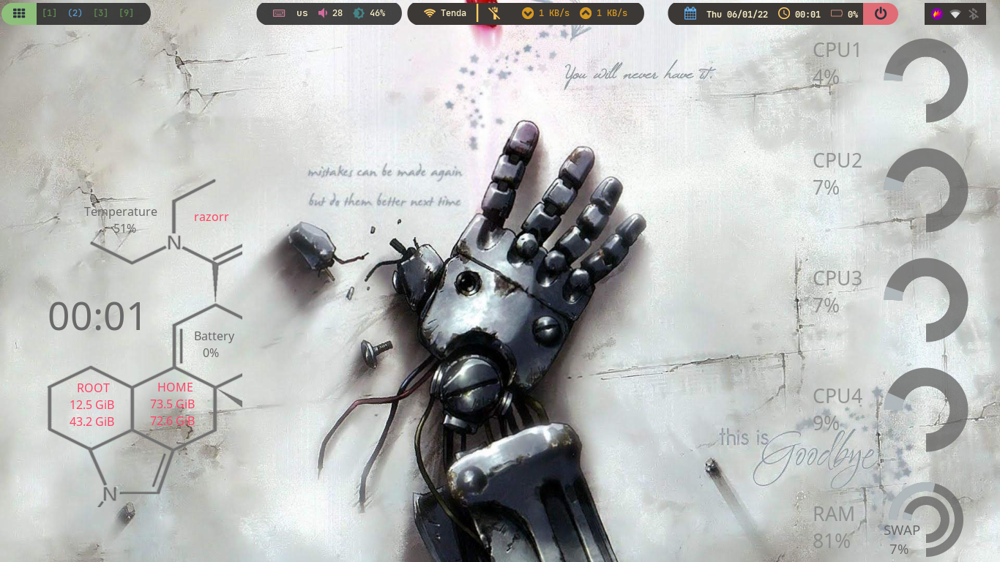
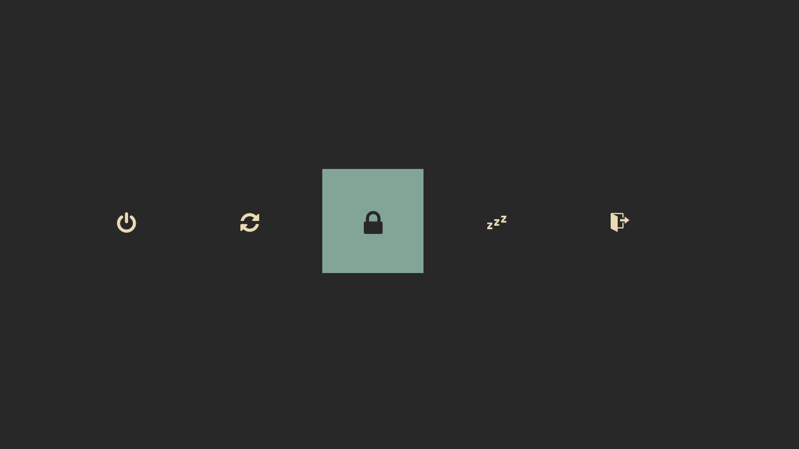
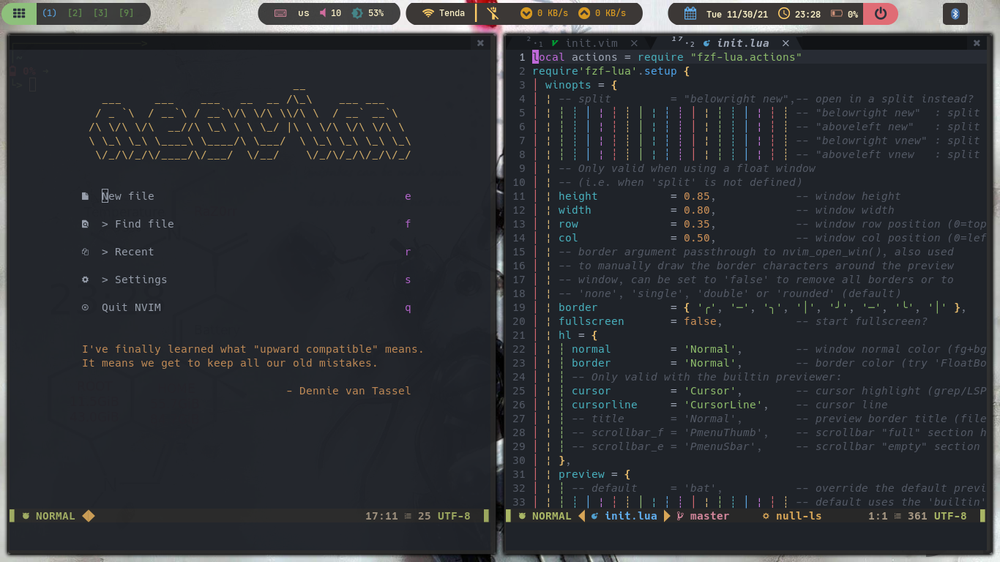
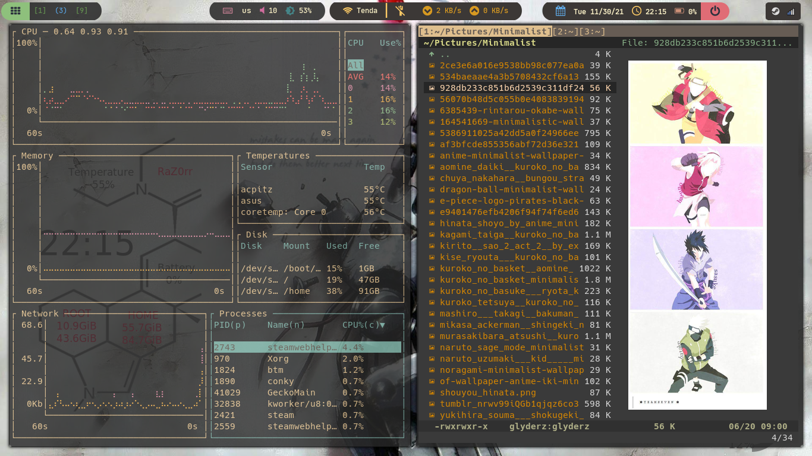

<h1 align="center">Dotfiles</h1>

<!-- HEADERS -->

  

  <b> ~ Linux configuration files ~ </b>

<!-- BADGES -->

    

    
    
   

<!-- INFORMATION -->

### Thanks for dropping by!
This is my personal collection of configuration files.\
Linux customizations and ricing configs for public reference and inspiration.

## 
Here are some details about my setup:
##
## ✨ Applications

| Program           | Name                                                                                                                         |
| ----------------- | -----------------------------------------------------------------------------------------------------------------------------|
| 🎨 Color Scheme    | [Dracula](https://st.suckless.org/patches/dracula/)(st), [Gruvbox](https://github.com/eendroroy/alacritty-theme)(alacritty), [Onedark](https://github.com/olimorris/onedarkpro.nvim)(nvim)  |
| 🚀 Window Manager  | [i3-gaps](https://github.com/Airblader/i3), [Herbstluftwm](https://herbstluftwm.org/)(hlwm)                                  |
| 🚧 Bar             | [Polybar](https://github.com/polybar/polybar)                                                                               |
| 🖊️ Text Editor     | [Neovim](https://github.com/neovim/neovim)                                                                                  |
| 🗃️ file manager    | [Vifm](https://vifm.info/)                                                                                                  |
| 🐚 Shell           | [Zsh](https://zsh.sourceforge.io/), [Bash](https://www.gnu.org/software/bash/)                                              |
| ⌨️ Terminal        | [Alacritty](https://github.com/alacritty/alacritty),[St](https://st.suckless.org/)                                          |
| 📄 Document Viewer | [Zathura](https://pwmt.org/projects/zathura/)                                                                               |
| ⌛ Compositor      | [Picom](https://github.com/yshui/picom)                                                                                     |
| ❤️ Others          | [Fzf](https://github.com/junegunn/fzf), [Rofi](https://github.com/davatorium/rofi), [Tmux](https://github.com/tmux/tmux), [Bottom](https://github.com/ClementTsang/bottom/), [betterlockscreen](https://github.com/betterlockscreen/betterlockscreen)    |

## 🖼️ Gallery

